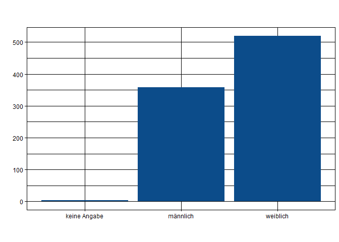
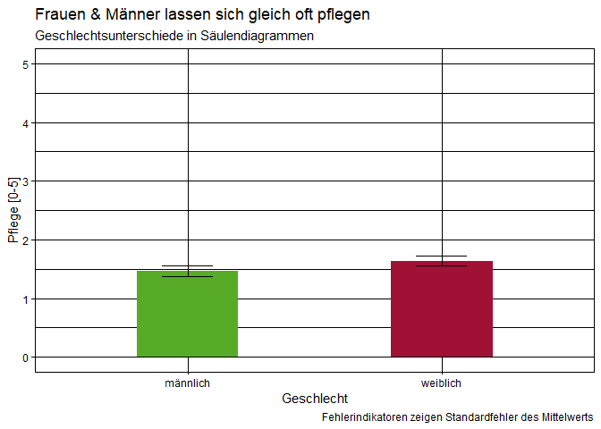

    library(ggplot2)

    ggplot(datensatz) +
     aes(x = gender, weight = human_toilett) +
     geom_bar(fill = "#0c4c8a") +
     labs(x = " ", y = " ", title = " ", subtitle = " ", caption = " ") +
     theme_linedraw()

    datensatz %>% 
      filter(gender != "keine Angabe") %>%
      group_by(gender) %>%
      summarise(human_toilett_m = mean(human_toilett, na.rm = TRUE)-1, human_toilett_sem = std.error(human_toilett)) %>%
    ggplot() +
     aes(x = gender, weight = human_toilett_m, 
         ymin = human_toilett_m-human_toilett_sem, 
         ymax = human_toilett_m+human_toilett_sem, 
         fill = gender) +
     geom_bar(fill = c(rwthfarben$green, rwthfarben$bordeaux), width = 0.4) +
      geom_errorbar(width = 0.2) +
      scale_y_continuous(limits = c(0,5)) +
     labs(x = "Geschlecht",
          y = "human_toilett [0-5]",
          title = "Frauen und Männer lassen sich gleich oft von einem Menschen zur Toilette bringen",
          subtitle = "Geschlechtsunterschiede in Säulendiagrammen",
          caption = "Fehlerindikatoren zeigen Standardfehler des Mittelwerts") +
     theme_linedraw() +
      NULL

    ggsave("C:/Users/Andrea Kristina/Desktop/RWTH/ws19/Basismodul Seminar Ordner fuer R/AbgabenMethodenWS1920/AndreaWiel/Diagramm_Wiel.pdf", width = 210, height = 297, units = "mm")
