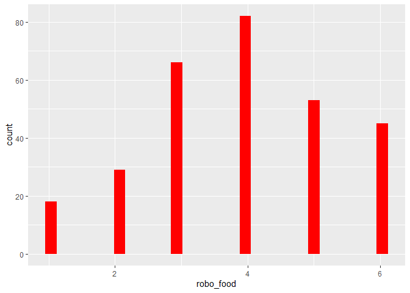
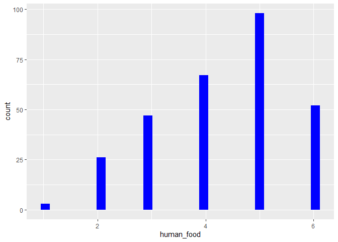

Deskriptive Statistik
================
Abel and Gerhardt and Köster  
04 12 2019

# Dies sind die desktiptiven Statistiken für den Datensatz.

Man sieht deskriptiv, dass die Probanden sich eher von einem Menschen,
als von einem Roboter füttern lassen würden.

``` r
dataset.short %>% psych::describe() %>% select(vars, mean, sd, median, min, max) 
```

    ##            vars  mean    sd median min max
    ## age           1 32.25 13.83   26.0  19  81
    ## gender*       2  2.58  0.51    3.0   1   3
    ## kut           3  4.32  1.03    4.5   1   6
    ## robo_food     4  3.88  1.40    4.0   1   6
    ## human_food    5  4.32  1.25    5.0   1   6

# Histogramme.

``` r
dataset %>% ggplot() +  aes(x = robo_food) + geom_histogram(bins = 30, fill="red")
```

<!-- -->

``` r
dataset %>% ggplot() +  aes(x = human_food) + geom_histogram(bins = 30, fill="blue")
```

<!-- -->

# ohne Pipe
```{r}
# psych::describe(dataset(select(robo_food)))
```
# mit Pipe
```{r}
# dataset %>% select(robo_food)
```
