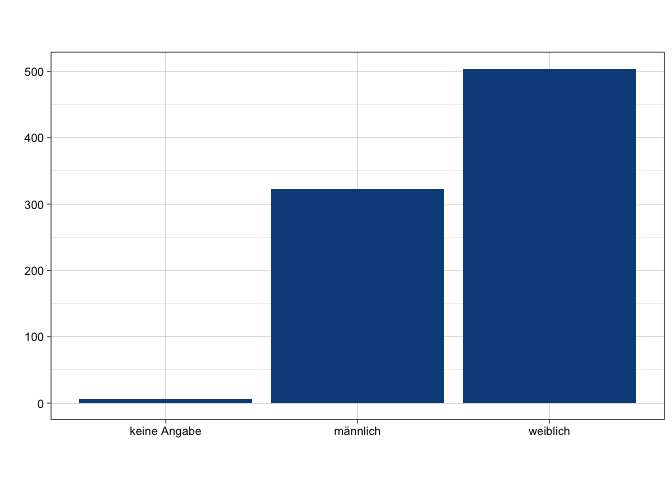
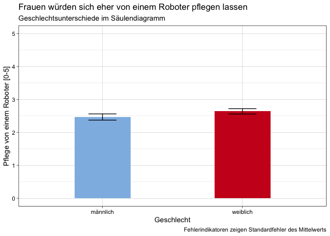

    ggplot(datensatz) +
      aes(x = gender, weight = pflege) +
      geom_bar(fill = "#0c4c8a") +
      labs(x = " ", y = " ", title = " ", subtitle = " ", caption = " ") +
      theme_linedraw()

Nach Anpassungen:
=================

    datensatz %>%
      filter(gender != "keine Angabe") %>%
      group_by(gender) %>%
      summarise(pflege_m = mean(pflege), pflege_sem = std.error(pflege)) %>%
      ggplot() +
      aes(x = gender, weight = pflege_m, ymin = pflege_m-pflege_sem, ymax = pflege_m+pflege_sem, fill = gender) +
      geom_bar(fill = c(rwthfarben$lightblue, rwthfarben$red), width = 0.4) +
      geom_errorbar(width = 0.2) +
      scale_y_continuous(limits = c(0,5)) +
      labs(x = "Geschlecht", 
           y = "Pflege von einem Roboter [0-5]", 
           title = "Frauen würden sich eher von einem Roboter pflegen lassen", 
           subtitle = "Geschlechtsunterschiede im Säulendiagramm", 
           caption = "Fehlerindikatoren zeigen Standardfehler des Mittelwerts") +
      theme_linedraw() +
      NULL

