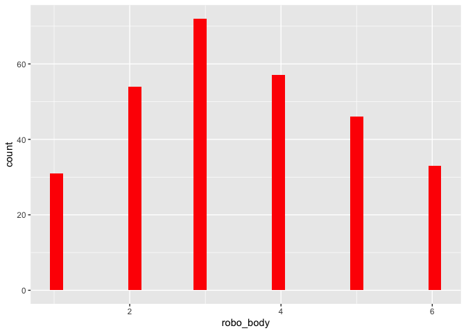

Dies sind die deskriptiven Statistiken für den Datensatz.
=========================================================

Man sieht deskriptiv, dass sich die Probanden ihren Körper insgesamt
sowohl von einem Menschen als auch von einem Roboter pflegen lassen
würden. Jedoch ist eine leichte Tendenz zur menschlichen Pflege
ersichtlich.

### Mit Pipe

    dataset.short %>% psych::describe() %>% select(vars, mean, sd, median, min, max)

    ##            vars  mean    sd median min max
    ## age           1 32.25 13.83   26.0  19  81
    ## gender*       2  2.58  0.51    3.0   1   3
    ## kut           3  4.32  1.03    4.5   1   6
    ## robo_body     4  3.45  1.50    3.0   1   6
    ## human_body    5  3.81  1.35    4.0   1   6

### Ohne Pipe

#### select(psych::describe(dataset.short), vars, mean, sd, median, min, max)

#### **Histogramme.**

    datensatz %>% ggplot() + aes(x = robo_body) + geom_histogram(bins = 30, fill="red")

    datensatz %>% ggplot() + aes(x = human_body) + geom_histogram(bins = 30, fill="blue")

