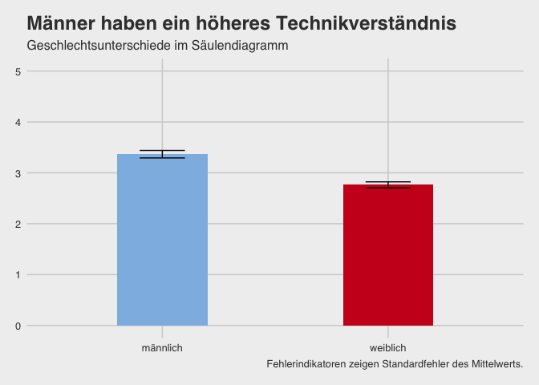

    dataset %>%
      filter(gender != "keine Angabe") %>%
      group_by(gender) %>%
      summarise(tv_m = mean(tv)-1, tv_sem = std.error(tv)) %>%
    ggplot() +
     aes(x = gender, weight = tv_m, ymin = tv_m - tv_sem, ymax = tv_m + tv_sem, fill = gender) +
     geom_bar(fill = c(rwthfarben$lightblue, rwthfarben$red), width = 0.4) +
      geom_errorbar(width = 0.2) +
      scale_y_continuous(limits = c(0,5)) +
     labs(x = "Geschlecht",
          y = "Technikverständnis [0-5]",
          title = "Männer haben ein höheres Technikverständnis",
          subtitle = "Geschlechtsunterschiede im Säulendiagramm",
          caption = "Fehlerindikatoren zeigen Standardfehler des Mittelwerts.") +
     theme_fivethirtyeight() +
     NULL

