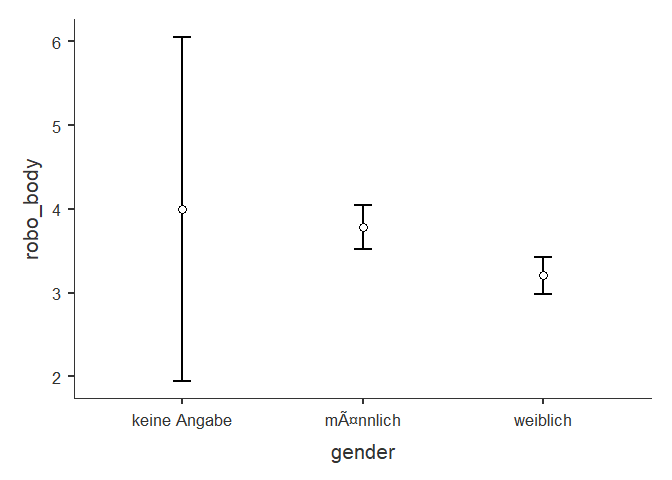
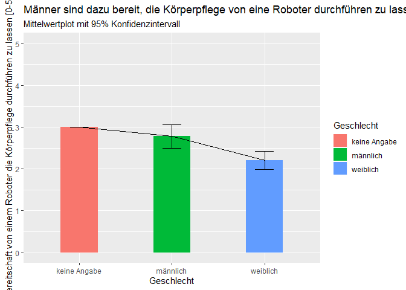

    datensatz <- readRDS("robo_pflege.rds")

Varianzanalyse
--------------

    datensatz %>%
      ANOVA(dep = "robo_body", factors = c("gender"), effectSize = "partEta", postHoc = robo_body ~ gender, emMeans = ~ gender, emmPlots = TRUE)

    ## 
    ##  ANOVA
    ## 
    ##  ANOVA                                                                           
    ##  ------------------------------------------------------------------------------- 
    ##                 Sum of Squares    df     Mean Square    F       p        <U+03B7>²p     
    ##  ------------------------------------------------------------------------------- 
    ##    gender                 23.8      2          11.88    5.44    0.005    0.036   
    ##    Residuals             632.8    290           2.18                             
    ##  ------------------------------------------------------------------------------- 
    ## 
    ## 
    ##  POST HOC TESTS
    ## 
    ##  Post Hoc Comparisons - gender                                                            
    ##  ---------------------------------------------------------------------------------------- 
    ##    gender               gender      Mean Difference    SE       df     t        p-tukey   
    ##  ---------------------------------------------------------------------------------------- 
    ##    keine Angabe    -    männlich              0.221    1.053    290    0.210      0.976   
    ##                    -    weiblich              0.793    1.051    290    0.755      0.731   
    ##    männlich        -    weiblich              0.572    0.175    290    3.257      0.004   
    ##  ----------------------------------------------------------------------------------------

    datensatz %>%
      group_by(gender) %>%
      summarise(robo_body_mean = mean(robo_body, na.rm = TRUE)-1, 
                count = n(),
                robo_body_se = std.error(robo_body)) %>%
    mutate(robo_body_ci = robo_body_se * 1.96) %>%
      ggplot() +
      aes(x = gender, fill = gender,
          y = robo_body_mean,
          ymin = robo_body_mean - robo_body_ci,
          ymax = robo_body_mean + robo_body_ci,
          group = 1) +
      geom_col(width = 0.4) +
      geom_line() +
      geom_errorbar(width = 0.2) + 
      scale_y_continuous(limits = c(0,5), breaks = 0:5) + 
      labs(title = "Männer sind dazu bereit, die Körperpflege von eine Roboter durchführen zu lassen", 
           subtitle = "Mittelwertplot mit 95% Konfidenzintervall",
           x = "Geschlecht",
           y = "Bereitschaft von einem Roboter die Körperpflege durchführen zu lassen [0-5]", fill = "Geschlecht")

 Es
gibt unterschiede zwischen den Geschlechtern in Hinblick auf die
Bereitschaft die Körperpflege von einem Roboter durchführen zu lassen
(F(2,290)=5.44\*\*\*, p &lt; 0.005). Dabei unterscheiden sich jedoch nur
Männer und Frauen in der Bereitschaft, die Körperpflege von einem
Roboter durchführen zu lassen (Unterschied M = 0.527, t(290) = 3.257,
p-tukey &lt; 0.004).
