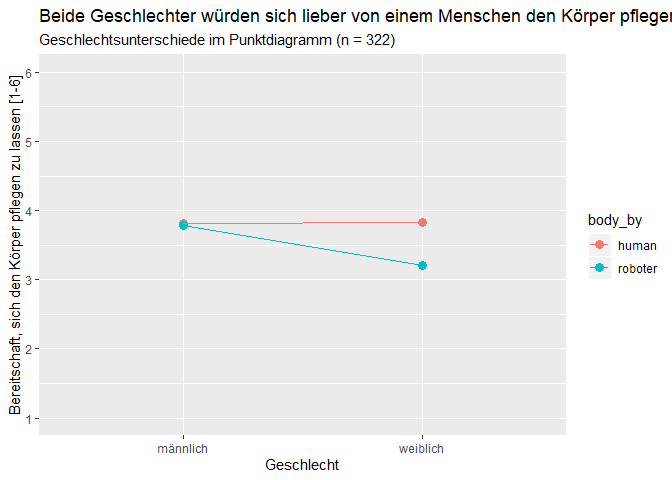
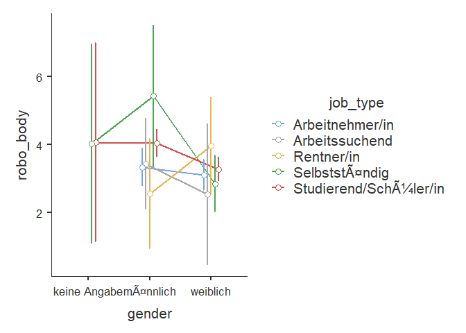

    datensatz <- readRDS("robo_pflege.rds")

Varianzanalyse
--------------

    datensatz %>%
      ANOVA(dep = "robo_body", factors = c("gender"), effectSize = "partEta", postHoc = robo_body ~ gender, emMeans = ~ gender, emmPlots = TRUE)

    ## 
    ##  ANOVA
    ## 
    ##  ANOVA                                                                           
    ##  ------------------------------------------------------------------------------- 
    ##                 Sum of Squares    df     Mean Square    F       p        <U+03B7>²p     
    ##  ------------------------------------------------------------------------------- 
    ##    gender                 23.8      2          11.88    5.44    0.005    0.036   
    ##    Residuals             632.8    290           2.18                             
    ##  ------------------------------------------------------------------------------- 
    ## 
    ## 
    ##  POST HOC TESTS
    ## 
    ##  Post Hoc Comparisons - gender                                                            
    ##  ---------------------------------------------------------------------------------------- 
    ##    gender               gender      Mean Difference    SE       df     t        p-tukey   
    ##  ---------------------------------------------------------------------------------------- 
    ##    keine Angabe    -    männlich              0.221    1.053    290    0.210      0.976   
    ##                    -    weiblich              0.793    1.051    290    0.755      0.731   
    ##    männlich        -    weiblich              0.572    0.175    290    3.257      0.004   
    ##  ----------------------------------------------------------------------------------------

    datensatz %>%
      group_by(gender) %>%
      summarise(robo_body_mean = mean(robo_body, na.rm = TRUE)-1, 
                count = n(),
                robo_body_se = std.error(robo_body)) %>%
    mutate(robo_body_ci = robo_body_se * 1.96) %>%
      ggplot() +
      aes(x = gender, fill = gender,
          y = robo_body_mean,
          ymin = robo_body_mean - robo_body_ci,
          ymax = robo_body_mean + robo_body_ci,
          group = 1) +
      geom_col(width = 0.4) +
      geom_line() +
      geom_errorbar(width = 0.2) + 
      scale_y_continuous(limits = c(0,5), breaks = 0:5) + 
      labs(title = "Männer sind dazu bereit, die Körperpflege von eine Roboter durchführen zu lassen", 
           subtitle = "Mittelwertplot mit 95% Konfidenzintervall",
           x = "Geschlecht",
           y = "Bereitschaft von einem Roboter die Körperpflege durchführen zu lassen [0-5]", fill = "Geschlecht")

 Es
gibt unterschiede zwischen den Geschlechtern in Hinblick auf die
Bereitschaft die Körperpflege von einem Roboter durchführen zu lassen
(F(2,290)=5.44\*\*\*, p &lt; 0.005). Dabei unterscheiden sich jedoch nur
Männer und Frauen in der Bereitschaft, die Körperpflege von einem
Roboter durchführen zu lassen (Unterschied M = 0.527, t(290) = 3.257,
p-tukey &lt; 0.004).

    datensatz %>%
      filter(gender != "keine Angabe") %>%
      group_by(gender) %>%
      summarise(human = mean(human_body, na.rm = TRUE),
                roboter = mean(robo_body, na.rm = TRUE)) %>%
      pivot_longer(cols = c(human, roboter),
                   names_to = "body_by",
                   values_to = "value") %>%
      ggplot() +
      aes(x = gender, y = value, color = body_by, group = body_by) +
      geom_point(size = 3) +
      geom_line() +
      scale_y_continuous(limits = c(1,6), breaks = 1:6) +
      labs(title = "Beide Geschlechter würden sich lieber von einem Menschen den Körper pflegen lassen.",
           subtitle = "Geschlechtsunterschiede im Punktdiagramm (n = 322)",
           x = "Geschlecht",
           y = "Bereitschaft, sich den Körper pflegen zu lassen [1-6]")

    datensatz %>%

      ancova(dep = "robo_body", factors = c("gender", "job_type"),
             covs = c("age"),
             effectSize = "partEta",
             postHoc = robo_body ~ gender + job_type + gender:job_type, emMeans = ~ gender + job_type + gender:job_type,
    emmPlots = TRUE)

    ## Error in Anova.III.lm(mod, error, singular.ok = singular.ok, ...) : 
    ##   there are aliased coefficients in the model

    ## Note: model has aliased coefficients
    ##       sums of squares computed by model comparison

    ## NOTE: Results may be misleading due to involvement in interactions
    ## NOTE: Results may be misleading due to involvement in interactions

    ## 
    ##  ANCOVA
    ## 
    ##  ANCOVA - robo_body                                                                 
    ##  ---------------------------------------------------------------------------------- 
    ##                       Sum of Squares    df     Mean Square    F    p        <U+03B7>²p     
    ##  ---------------------------------------------------------------------------------- 
    ##    gender                      0.000    NaN                                         
    ##    job_type                    0.313      1          0.313         0.705            
    ##    age                         0.642      1          0.642         0.588            
    ##    gender:job_type            20.618      5          4.124         0.096            
    ##    Residuals                 604.614    277          2.183                          
    ##  ---------------------------------------------------------------------------------- 
    ##    Note. Singular fit encountered; one or more predictor variables are a linear
    ##    combination of other predictor variables
    ## 
    ## 
    ##  POST HOC TESTS
    ## 
    ##  Post Hoc Comparisons - gender                                                           
    ##  --------------------------------------------------------------------------------------- 
    ##    gender               gender      Mean Difference    SE       df     t       p-tukey   
    ##  --------------------------------------------------------------------------------------- 
    ##    keine Angabe    -    männlich                                                         
    ##                    -    weiblich                                                         
    ##    männlich        -    weiblich              0.616    0.392    277    1.57      0.259   
    ##  --------------------------------------------------------------------------------------- 
    ## 
    ## 
    ##  Post Hoc Comparisons - job_type                                                                          
    ##  -------------------------------------------------------------------------------------------------------- 
    ##    job_type                job_type                 Mean Difference    SE       df     t        p-tukey   
    ##  -------------------------------------------------------------------------------------------------------- 
    ##    Arbeitnehmer/in    -    Arbeitssuchend                                                                 
    ##                       -    Rentner/in                                                                     
    ##                       -    Selbstständig                                                                  
    ##                       -    Studierend/Schüler/in                                                          
    ##    Arbeitssuchend     -    Rentner/in                                                                     
    ##                       -    Selbstständig                                                                  
    ##                       -    Studierend/Schüler/in                                                          
    ##    Rentner/in         -    Selbstständig                                                                  
    ##                       -    Studierend/Schüler/in                                                          
    ##    Selbstständig      -    Studierend/Schüler/in              0.307    0.811    277    0.379      0.996   
    ##  -------------------------------------------------------------------------------------------------------- 
    ## 
    ## 
    ##  Post Hoc Comparisons - gender:job_type                                                                                                            
    ##  ------------------------------------------------------------------------------------------------------------------------------------------------- 
    ##    gender          job_type                      gender          job_type                 Mean Difference    SE       df     t           p-tukey   
    ##  ------------------------------------------------------------------------------------------------------------------------------------------------- 
    ##    keine Angabe    Arbeitnehmer/in          -    keine Angabe    Arbeitssuchend                                                                    
    ##                                             -    keine Angabe    Rentner/in                                                                        
    ##                                             -    keine Angabe    Selbstständig                                                                     
    ##                                             -    keine Angabe    Studierend/Schüler/in                                                             
    ##                                             -    männlich        Arbeitnehmer/in                                                                   
    ##                                             -    männlich        Arbeitssuchend                                                                    
    ##                                             -    männlich        Rentner/in                                                                        
    ##                                             -    männlich        Selbstständig                                                                     
    ##                                             -    männlich        Studierend/Schüler/in                                                             
    ##                                             -    weiblich        Arbeitnehmer/in                                                                   
    ##                                             -    weiblich        Arbeitssuchend                                                                    
    ##                                             -    weiblich        Rentner/in                                                                        
    ##                                             -    weiblich        Selbstständig                                                                     
    ##                                             -    weiblich        Studierend/Schüler/in                                                             
    ##                    Arbeitssuchend           -    keine Angabe    Rentner/in                                                                        
    ##                                             -    keine Angabe    Selbstständig                                                                     
    ##                                             -    keine Angabe    Studierend/Schüler/in                                                             
    ##                                             -    männlich        Arbeitnehmer/in                                                                   
    ##                                             -    männlich        Arbeitssuchend                                                                    
    ##                                             -    männlich        Rentner/in                                                                        
    ##                                             -    männlich        Selbstständig                                                                     
    ##                                             -    männlich        Studierend/Schüler/in                                                             
    ##                                             -    weiblich        Arbeitnehmer/in                                                                   
    ##                                             -    weiblich        Arbeitssuchend                                                                    
    ##                                             -    weiblich        Rentner/in                                                                        
    ##                                             -    weiblich        Selbstständig                                                                     
    ##                                             -    weiblich        Studierend/Schüler/in                                                             
    ##                    Rentner/in               -    keine Angabe    Selbstständig                                                                     
    ##                                             -    keine Angabe    Studierend/Schüler/in                                                             
    ##                                             -    männlich        Arbeitnehmer/in                                                                   
    ##                                             -    männlich        Arbeitssuchend                                                                    
    ##                                             -    männlich        Rentner/in                                                                        
    ##                                             -    männlich        Selbstständig                                                                     
    ##                                             -    männlich        Studierend/Schüler/in                                                             
    ##                                             -    weiblich        Arbeitnehmer/in                                                                   
    ##                                             -    weiblich        Arbeitssuchend                                                                    
    ##                                             -    weiblich        Rentner/in                                                                        
    ##                                             -    weiblich        Selbstständig                                                                     
    ##                                             -    weiblich        Studierend/Schüler/in                                                             
    ##                    Selbstständig            -    keine Angabe    Studierend/Schüler/in            -0.0292    2.090    277    -0.01395      1.000   
    ##                                             -    männlich        Arbeitnehmer/in                   0.6874    1.507    277     0.45616      1.000   
    ##                                             -    männlich        Arbeitssuchend                    0.5872    1.619    277     0.36277      1.000   
    ##                                             -    männlich        Rentner/in                        1.4701    1.701    277     0.86431      1.000   
    ##                                             -    männlich        Selbstständig                    -1.3979    1.819    277    -0.76844      1.000   
    ##                                             -    männlich        Studierend/Schüler/in            -0.0181    1.488    277    -0.01219      1.000   
    ##                                             -    weiblich        Arbeitnehmer/in                   0.9184    1.499    277     0.61262      1.000   
    ##                                             -    weiblich        Arbeitssuchend                    1.4942    1.809    277     0.82575      1.000   
    ##                                             -    weiblich        Rentner/in                        0.0695    1.654    277     0.04203      1.000   
    ##                                             -    weiblich        Selbstständig                     1.1789    1.542    277     0.76450      1.000   
    ##                                             -    weiblich        Studierend/Schüler/in             0.7502    1.486    277     0.50499      1.000   
    ##                    Studierend/Schüler/in    -    männlich        Arbeitnehmer/in                   0.7166    1.514    277     0.47329      1.000   
    ##                                             -    männlich        Arbeitssuchend                    0.6163    1.619    277     0.38076      1.000   
    ##                                             -    männlich        Rentner/in                        1.4993    1.715    277     0.87444      1.000   
    ##                                             -    männlich        Selbstständig                    -1.3688    1.826    277    -0.74979      1.000   
    ##                                             -    männlich        Studierend/Schüler/in             0.0110    1.488    277     0.00741      1.000   
    ##                                             -    weiblich        Arbeitnehmer/in                   0.9475    1.505    277     0.62950      1.000   
    ##                                             -    weiblich        Arbeitssuchend                    1.5233    1.810    277     0.84164      1.000   
    ##                                             -    weiblich        Rentner/in                        0.0987    1.669    277     0.05912      1.000   
    ##                                             -    weiblich        Selbstständig                     1.2081    1.550    277     0.77945      1.000   
    ##                                             -    weiblich        Studierend/Schüler/in             0.7793    1.485    277     0.52471      1.000   
    ##    männlich        Arbeitnehmer/in          -    männlich        Arbeitssuchend                   -0.1003    0.730    277    -0.13726      1.000   
    ##                                             -    männlich        Rentner/in                        0.7827    0.812    277     0.96361      1.000   
    ##                                             -    männlich        Selbstständig                    -2.0854    1.073    277    -1.94408      0.828   
    ##                                             -    männlich        Studierend/Schüler/in            -0.7056    0.362    277    -1.95110      0.825   
    ##                                             -    weiblich        Arbeitnehmer/in                   0.2309    0.321    277     0.71836      1.000   
    ##                                             -    weiblich        Arbeitssuchend                    0.8067    1.088    277     0.74158      1.000   
    ##                                             -    weiblich        Rentner/in                       -0.6179    0.702    277    -0.88034      1.000   
    ##                                             -    weiblich        Selbstständig                     0.4915    0.464    277     1.05838      0.999   
    ##                                             -    weiblich        Studierend/Schüler/in             0.0628    0.352    277     0.17828      1.000   
    ##                    Arbeitssuchend           -    männlich        Rentner/in                        0.8830    1.080    277     0.81742      1.000   
    ##                                             -    männlich        Selbstständig                    -1.9851    1.254    277    -1.58289      0.961   
    ##                                             -    männlich        Studierend/Schüler/in            -0.6053    0.683    277    -0.88619      1.000   
    ##                                             -    weiblich        Arbeitnehmer/in                   0.3312    0.713    277     0.46447      1.000   
    ##                                             -    weiblich        Arbeitssuchend                    0.9070    1.236    277     0.73373      1.000   
    ##                                             -    weiblich        Rentner/in                       -0.5177    1.006    277    -0.51477      1.000   
    ##                                             -    weiblich        Selbstständig                     0.5917    0.801    277     0.73870      1.000   
    ##                                             -    weiblich        Studierend/Schüler/in             0.1630    0.678    277     0.24046      1.000   
    ##                    Rentner/in               -    männlich        Selbstständig                    -2.8681    1.298    277    -2.20984      0.658   
    ##                                             -    männlich        Studierend/Schüler/in            -1.4883    0.877    277    -1.69751      0.932   
    ##                                             -    weiblich        Arbeitnehmer/in                  -0.5518    0.811    277    -0.68037      1.000   
    ##                                             -    weiblich        Arbeitssuchend                    0.0240    1.346    277     0.01785      1.000   
    ##                                             -    weiblich        Rentner/in                       -1.4006    0.954    277    -1.46798      0.980   
    ##                                             -    weiblich        Selbstständig                    -0.2912    0.863    277    -0.33748      1.000   
    ##                                             -    weiblich        Studierend/Schüler/in            -0.7200    0.873    277    -0.82481      1.000   
    ##                    Selbstständig            -    männlich        Studierend/Schüler/in             1.3798    1.082    277     1.27542      0.995   
    ##                                             -    weiblich        Arbeitnehmer/in                   2.3163    1.066    277     2.17237      0.684   
    ##                                             -    weiblich        Arbeitssuchend                    2.8921    1.491    277     1.94005      0.831   
    ##                                             -    weiblich        Rentner/in                        1.4675    1.231    277     1.19171      0.997   
    ##                                             -    weiblich        Selbstständig                     2.5768    1.117    277     2.30723      0.586   
    ##                                             -    weiblich        Studierend/Schüler/in             2.1481    1.079    277     1.99145      0.802   
    ##                    Studierend/Schüler/in    -    weiblich        Arbeitnehmer/in                   0.9365    0.324    277     2.88694      0.209   
    ##                                             -    weiblich        Arbeitssuchend                    1.5123    1.059    277     1.42786      0.984   
    ##                                             -    weiblich        Rentner/in                        0.0877    0.783    277     0.11189      1.000   
    ##                                             -    weiblich        Selbstständig                     1.1970    0.489    277     2.44617      0.483   
    ##                                             -    weiblich        Studierend/Schüler/in             0.7683    0.230    277     3.34128      0.064   
    ##    weiblich        Arbeitnehmer/in          -    weiblich        Arbeitssuchend                    0.5758    1.077    277     0.53481      1.000   
    ##                                             -    weiblich        Rentner/in                       -0.8489    0.702    277    -1.21003      0.997   
    ##                                             -    weiblich        Selbstständig                     0.2605    0.450    277     0.57902      1.000   
    ##                                             -    weiblich        Studierend/Schüler/in            -0.1682    0.314    277    -0.53624      1.000   
    ##                    Arbeitssuchend           -    weiblich        Rentner/in                       -1.4247    1.286    277    -1.10763      0.999   
    ##                                             -    weiblich        Selbstständig                    -0.3153    1.136    277    -0.27748      1.000   
    ##                                             -    weiblich        Studierend/Schüler/in            -0.7440    1.056    277    -0.70461      1.000   
    ##                    Rentner/in               -    weiblich        Selbstständig                     1.1094    0.759    277     1.46169      0.980   
    ##                                             -    weiblich        Studierend/Schüler/in             0.6807    0.779    277     0.87374      1.000   
    ##                    Selbstständig            -    weiblich        Studierend/Schüler/in            -0.4287    0.482    277    -0.88887      1.000   
    ##  -------------------------------------------------------------------------------------------------------------------------------------------------

