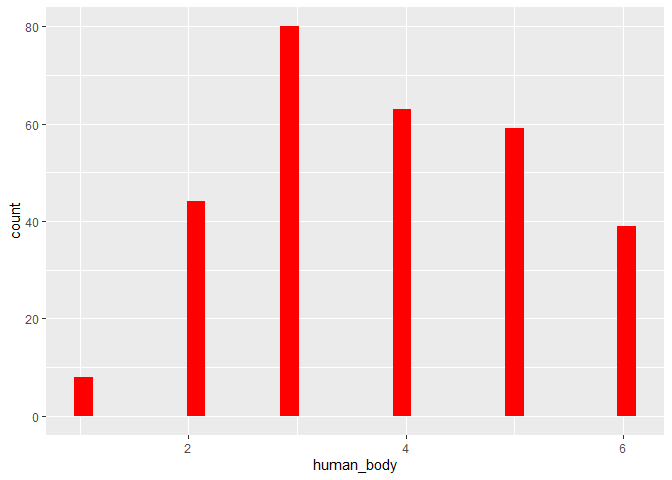

### **Dies sind die deskriptiven Statistiken für den Datensatz**
###### Man sieht, dass die Probanden ihren Körper insgesamt sowohl von dem Menschen als auch von einem Roboter pflegen lassen würden. Jedoch ist eine leichte Tendenz hin zum Menschen ablesbar.

    datensatz %>% select(age, gender, robo_body, human_body) %>%psych::describe()

    ##            vars   n  mean    sd median trimmed  mad min max range  skew
    ## age           1 325 32.25 13.83     26   30.13 5.93  19  81    62  1.25
    ## gender*       2 325  2.58  0.51      3    2.61 0.00   1   3     2 -0.52
    ## robo_body     3 293  3.45  1.50      3    3.44 1.48   1   6     5  0.10
    ## human_body    4 293  3.81  1.35      4    3.80 1.48   1   6     5  0.03
    ##            kurtosis   se
    ## age            0.36 0.77
    ## gender*       -1.25 0.03
    ## robo_body     -0.96 0.09
    ## human_body    -0.93 0.08
    
### **Histogramme.**

    datensatz %>% select(human_body) %>% ggplot() + aes(x=human_body) + geom_histogram(bins = 30, fill="red")

    datensatz %>% select(robo_body) %>% ggplot() + aes(x=robo_body) + geom_histogram(bins = 30, fill="blue")

