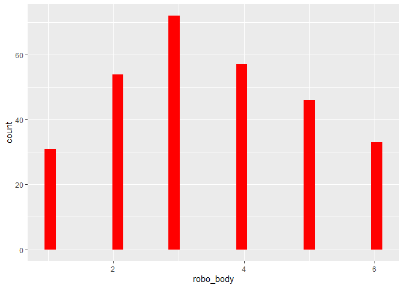

    datensatz %>% names()

    ##  [1] "age"             "gender"          "job_type"       
    ##  [4] "job"             "robo_bed"        "robo_food"      
    ##  [7] "robo_med"        "robo_body"       "robo_hair_wash" 
    ## [10] "robo_mass"       "robo_bath"       "robo_wash"      
    ## [13] "robo_toilett"    "robot_face"      "robo_hair_cut"  
    ## [16] "human_bed"       "human_food"      "human_med"      
    ## [19] "human_body"      "human_hair_wash" "human_mass"     
    ## [22] "human_bath"      "human_wash"      "human_toilett"  
    ## [25] "human_face"      "human_hair_cut"  "ht"             
    ## [28] "rt"              "comments"        "kut"            
    ## [31] "diffpref"        "tv"              "dsb"            
    ## [34] "autot"           "pflege"

    names(datensatz)

    ##  [1] "age"             "gender"          "job_type"       
    ##  [4] "job"             "robo_bed"        "robo_food"      
    ##  [7] "robo_med"        "robo_body"       "robo_hair_wash" 
    ## [10] "robo_mass"       "robo_bath"       "robo_wash"      
    ## [13] "robo_toilett"    "robot_face"      "robo_hair_cut"  
    ## [16] "human_bed"       "human_food"      "human_med"      
    ## [19] "human_body"      "human_hair_wash" "human_mass"     
    ## [22] "human_bath"      "human_wash"      "human_toilett"  
    ## [25] "human_face"      "human_hair_cut"  "ht"             
    ## [28] "rt"              "comments"        "kut"            
    ## [31] "diffpref"        "tv"              "dsb"            
    ## [34] "autot"           "pflege"

    datensatz %>% select(age, gender, robo_body, human_body) %>%psych::describe()

    ##            vars   n  mean    sd median trimmed  mad min max range  skew
    ## age           1 325 32.25 13.83     26   30.13 5.93  19  81    62  1.25
    ## gender*       2 325  2.58  0.51      3    2.61 0.00   1   3     2 -0.52
    ## robo_body     3 293  3.45  1.50      3    3.44 1.48   1   6     5  0.10
    ## human_body    4 293  3.81  1.35      4    3.80 1.48   1   6     5  0.03
    ##            kurtosis   se
    ## age            0.36 0.77
    ## gender*       -1.25 0.03
    ## robo_body     -0.96 0.09
    ## human_body    -0.93 0.08

    datensatz %>% select(human_body) %>% ggplot() + aes(x=human_body) + geom_histogram(bins = 30, fill="red")

    ## Warning: Removed 32 rows containing non-finite values (stat_bin).

    datensatz %>% names()

    ##  [1] "age"             "gender"          "job_type"       
    ##  [4] "job"             "robo_bed"        "robo_food"      
    ##  [7] "robo_med"        "robo_body"       "robo_hair_wash" 
    ## [10] "robo_mass"       "robo_bath"       "robo_wash"      
    ## [13] "robo_toilett"    "robot_face"      "robo_hair_cut"  
    ## [16] "human_bed"       "human_food"      "human_med"      
    ## [19] "human_body"      "human_hair_wash" "human_mass"     
    ## [22] "human_bath"      "human_wash"      "human_toilett"  
    ## [25] "human_face"      "human_hair_cut"  "ht"             
    ## [28] "rt"              "comments"        "kut"            
    ## [31] "diffpref"        "tv"              "dsb"            
    ## [34] "autot"           "pflege"

    names(datensatz)

    ##  [1] "age"             "gender"          "job_type"       
    ##  [4] "job"             "robo_bed"        "robo_food"      
    ##  [7] "robo_med"        "robo_body"       "robo_hair_wash" 
    ## [10] "robo_mass"       "robo_bath"       "robo_wash"      
    ## [13] "robo_toilett"    "robot_face"      "robo_hair_cut"  
    ## [16] "human_bed"       "human_food"      "human_med"      
    ## [19] "human_body"      "human_hair_wash" "human_mass"     
    ## [22] "human_bath"      "human_wash"      "human_toilett"  
    ## [25] "human_face"      "human_hair_cut"  "ht"             
    ## [28] "rt"              "comments"        "kut"            
    ## [31] "diffpref"        "tv"              "dsb"            
    ## [34] "autot"           "pflege"

    datensatz %>% select(age, gender, robo_body, human_body) %>%psych::describe()

    ##            vars   n  mean    sd median trimmed  mad min max range  skew
    ## age           1 325 32.25 13.83     26   30.13 5.93  19  81    62  1.25
    ## gender*       2 325  2.58  0.51      3    2.61 0.00   1   3     2 -0.52
    ## robo_body     3 293  3.45  1.50      3    3.44 1.48   1   6     5  0.10
    ## human_body    4 293  3.81  1.35      4    3.80 1.48   1   6     5  0.03
    ##            kurtosis   se
    ## age            0.36 0.77
    ## gender*       -1.25 0.03
    ## robo_body     -0.96 0.09
    ## human_body    -0.93 0.08

    datensatz %>% select(robo_body) %>% ggplot() + aes(x=robo_body) + geom_histogram(bins = 30, fill="blue")

    ## Warning: Removed 32 rows containing non-finite values (stat_bin).

