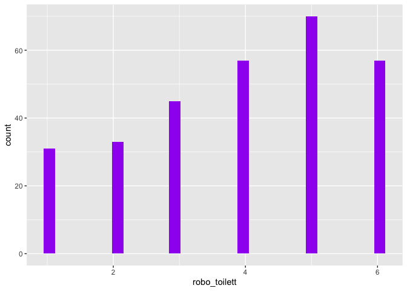
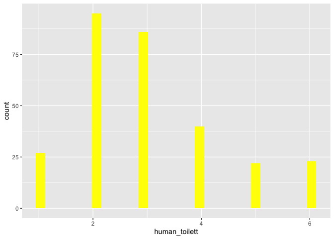

Man sieht deskriptiv, dass die Probanden sich eher von einem Roboter,
als von einem Menschen auf die Toilette begleiten lassen würden.

    #mit pipe
    datensatz %>% select(age, gender, robo_toilett, human_toilett) %>% psych::describe() %>% select( vars, mean, sd, median, min, max)

    ##               vars  mean    sd median min max
    ## age              1 32.25 13.83     26  19  81
    ## gender*          2  2.58  0.51      3   1   3
    ## robo_toilett     3  3.93  1.61      4   1   6
    ## human_toilett    4  3.01  1.36      3   1   6

    #umschreiben ohne pipe
    #psych::describe(select(datensatz, age, gender, robo_toilett, human_toilett))

    datensatz %>% select(robo_toilett) %>% ggplot() + aes(x = robo_toilett) + geom_histogram(bins = 30, fill="purple")

    ## Warning: Removed 32 rows containing non-finite values (stat_bin).

    datensatz %>% select(human_toilett) %>% ggplot() + aes(x = human_toilett) + geom_histogram(bins = 30, fill="yellow")

    ## Warning: Removed 32 rows containing non-finite values (stat_bin).

