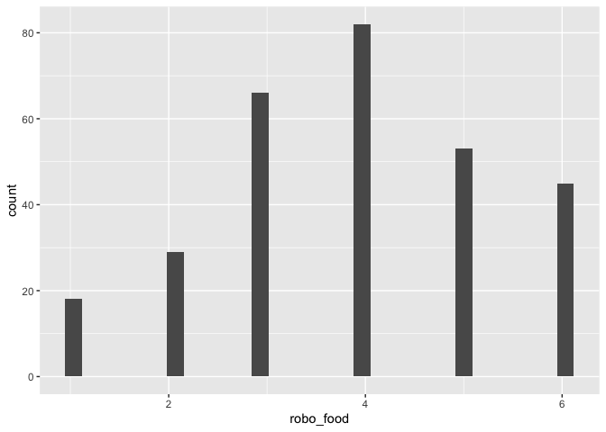
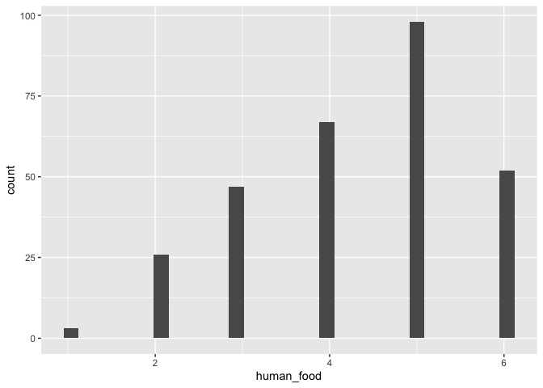

    #data %>% names()

    names(data)

    ##  [1] "age"             "gender"          "job_type"       
    ##  [4] "job"             "robo_bed"        "robo_food"      
    ##  [7] "robo_med"        "robo_body"       "robo_hair_wash" 
    ## [10] "robo_mass"       "robo_bath"       "robo_wash"      
    ## [13] "robo_toilett"    "robot_face"      "robo_hair_cut"  
    ## [16] "human_bed"       "human_food"      "human_med"      
    ## [19] "human_body"      "human_hair_wash" "human_mass"     
    ## [22] "human_bath"      "human_wash"      "human_toilett"  
    ## [25] "human_face"      "human_hair_cut"  "ht"             
    ## [28] "rt"              "comments"        "kut"            
    ## [31] "diffpref"        "tv"              "dsb"            
    ## [34] "autot"           "pflege"

    data %>% select(robo_food, human_food) %>% psych::describe()

    ##            vars   n mean   sd median trimmed  mad min max range  skew
    ## robo_food     1 293 3.88 1.40      4    3.93 1.48   1   6     5 -0.21
    ## human_food    2 293 4.32 1.25      5    4.41 1.48   1   6     5 -0.47
    ##            kurtosis   se
    ## robo_food     -0.66 0.08
    ## human_food    -0.60 0.07

    data %>%  select(robo_food) %>% ggplot() + aes(x = robo_food) + geom_histogram(bins = 30)

    ## Warning: Removed 32 rows containing non-finite values (stat_bin).

    data %>%  select(human_food) %>% ggplot() + aes(x = human_food) + geom_histogram(bins = 30)

    ## Warning: Removed 32 rows containing non-finite values (stat_bin).

    #Die Befragten stimmen eher zu, sich von einem Menschen füttern zu lassen, als von einem Roboter.

\`\`\`
