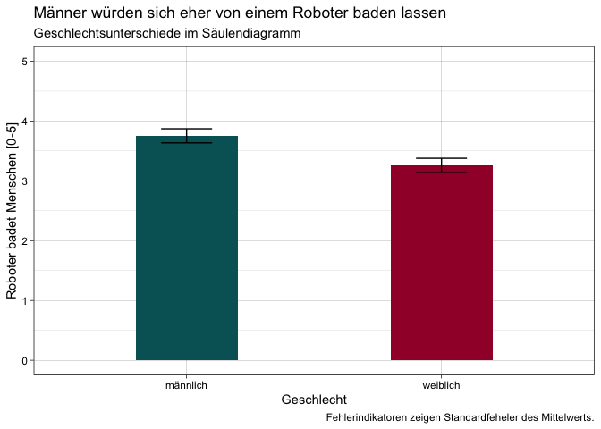

Säulendiagramm
==============

    datensatz %>% 
      filter(gender != "keine Angabe") %>% 
      group_by(gender) %>% 
      summarise(robo_bath_m = mean(robo_bath, na.rm = TRUE)-1, robo_bath_sem = std.error(robo_bath)) %>% 
    ggplot() +
     aes(x = gender, weight = robo_bath_m, ymin = robo_bath_m-robo_bath_sem, ymax = robo_bath_m+robo_bath_sem, fill = gender) +
     geom_bar(fill = c(rwthfarben$petrol, rwthfarben$bordeaux), width = 0.4) +
     geom_errorbar(width = 0.2) +
     scale_y_continuous(limits = c(0,5)) +
     labs(x = "Geschlecht", 
          y = "Roboter badet Menschen [0-5]", 
          title = "Männer würden sich eher von einem Roboter baden lassen", 
          subtitle = "Geschlechtsunterschiede im Säulendiagramm", 
          caption = "Fehlerindikatoren zeigen Standardfeheler des Mittelwerts.") +
     theme_linedraw() + 
    NULL

