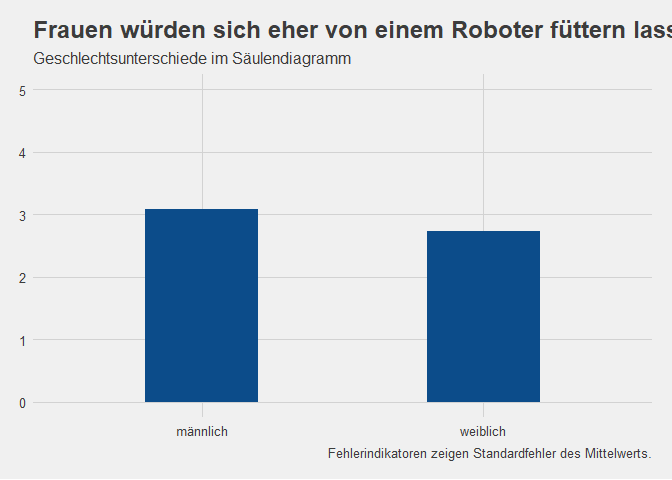

    dataset.short %>% 
    filter(gender != "keine Angabe") %>%
    group_by(gender) %>%
    summarise(Mean = mean(robo_food, na.rm = TRUE)-1, sem = std.error(robo_food)) %>% 
    ggplot() +
     aes(x = gender, weight = Mean, ymin = Mean-sem , ymax = Mean+sem, fill = gender) +
     geom_bar(fill = "#0c4c8a", width = 0.4) +
     scale_y_continuous(limits = c(0,5)) +
     labs(x = "Geschlecht",
          y = "Bereitschaft, sich von einem Roboter füttern zu lassen",
          title = "Frauen würden sich eher von einem Roboter füttern lassen als Männer.",
          subtitle = "Geschlechtsunterschiede im Säulendiagramm",
          caption = "Fehlerindikatoren zeigen Standardfehler des Mittelwerts.") +
     theme_fivethirtyeight() +
      NULL

