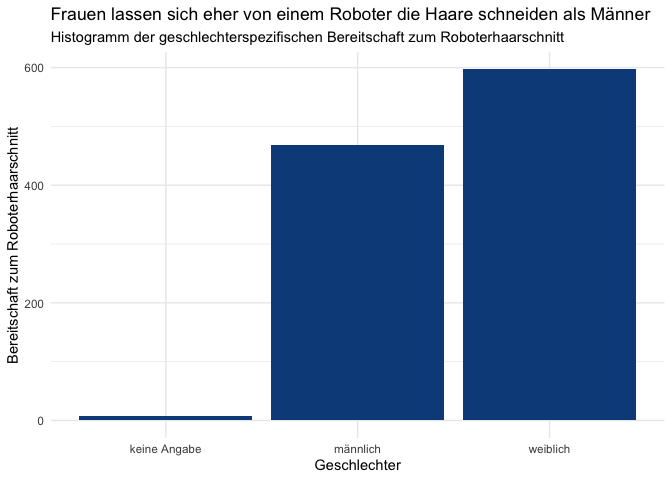
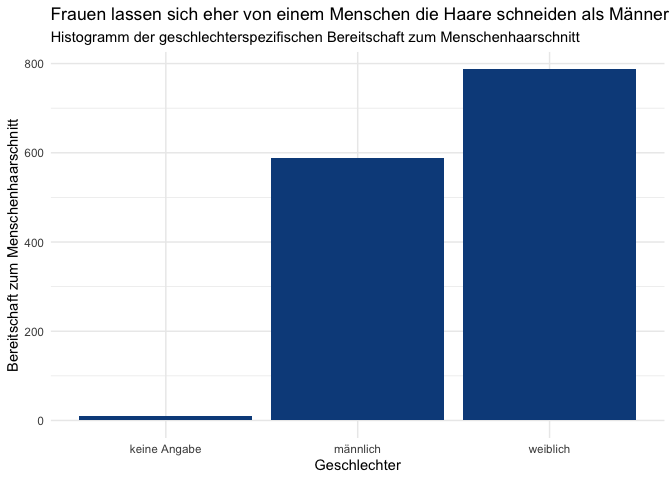

Dies sind die desktiptiven Statistiken für den Datensatz.
=========================================================

Man sieht deskriptiv, dass sich die Probanden eher von einem Menschen,
als von einem Roboter die Haare schneiden lassen würden.

    dataset.short %>% psych::describe() %>% select(vars, mean, sd, median, min, max) 

    ##                vars  mean    sd median min max
    ## age               1 32.25 13.83   26.0  19  81
    ## gender*           2  2.58  0.51    3.0   1   3
    ## kut               3  4.32  1.03    4.5   1   6
    ## robo_hair_cut     4  3.66  1.61    4.0   1   6
    ## human_hair_cut    5  4.73  1.16    5.0   1   6

Histogramme.
============

    ggplot(dataset) +
     aes(x = gender, weight = robo_hair_cut) +
     geom_bar(fill = "#0c4c8a") +
     labs(x = "Geschlechter", y = "Bereitschaft zum Roboterhaarschnitt", title = "Frauen lassen sich eher von einem Roboter die Haare schneiden als Männer", subtitle = "Histogramm der geschlechterspezifischen Bereitschaft zum Roboterhaarschnitt") +
     theme_minimal()

    ggplot(dataset) +
     aes(x = gender, weight = human_hair_cut) +
     geom_bar(fill = "#0c4c8a") +
     labs(x = "Geschlechter", y = "Bereitschaft zum Menschenhaarschnitt", title = "Frauen lassen sich eher von einem Menschen die Haare schneiden als Männer", subtitle = "Histogramm der geschlechterspezifischen Bereitschaft zum Menschenhaarschnitt") +
     theme_minimal()

