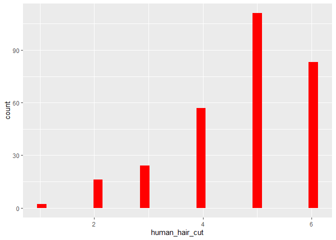
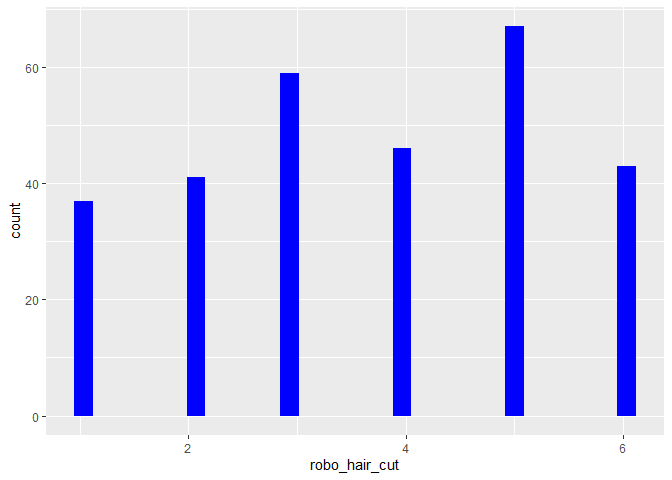

Untitled
================
Freudenhammer + Massau
05 12 2019

# Verkürzung des Datensatzes

``` r
datensatz_kurz <- datensatz %>% select(robo_hair_cut, human_hair_cut) 
```

# Describe Datensatz

``` r
datensatz_kurz %>% psych::describe() %>%  select(vars, mean, sd, median, min, max)
```

    ##                vars mean   sd median min max
    ## robo_hair_cut     1 3.66 1.61      4   1   6
    ## human_hair_cut    2 4.73 1.16      5   1   6

Man sieht deskriptiv, dass die Probanden sich eher von einem Menschen,
als von einem Roboter die Haare schneiden lassen würden.

# Histogramme plotten

``` r
datensatz_kurz %>% ggplot() + aes(x = human_hair_cut) + geom_histogram(bins = 30, fill = "red")
```

<!-- -->

``` r
datensatz_kurz %>% ggplot() + aes(x = robo_hair_cut) + geom_histogram(bins = 30, fill = "blue")
```

<!-- -->

# ohne Pipe

``` r
# psych::describe(datensatz(select(human_hair_cut)))
```

# mit Pipe

``` r
# datensatz %>% select(human_hair_cut)
```
