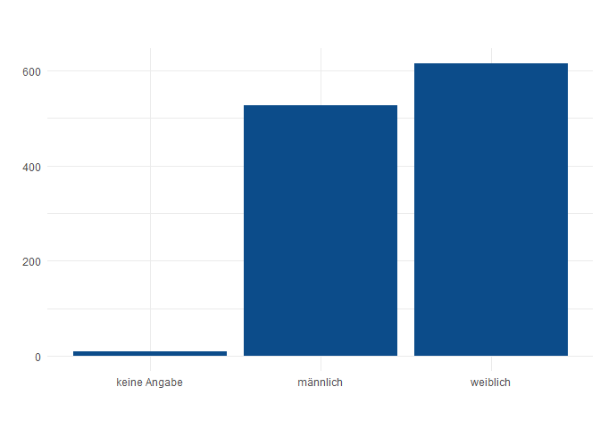
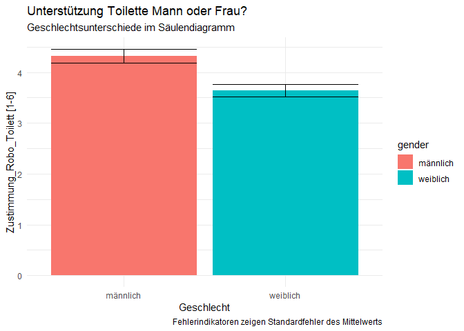

Diagramm\_FreudenhammerMassau
================
FreudenhammerMassau
10 12 2019

``` r
library(tidyverse)
```

    ## -- Attaching packages --------------------------------------------------------------------------------------------- tidyverse 1.3.0 --

    ## v ggplot2 3.2.1     v purrr   0.3.3
    ## v tibble  2.1.3     v dplyr   0.8.3
    ## v tidyr   1.0.0     v stringr 1.4.0
    ## v readr   1.3.1     v forcats 0.4.0

    ## -- Conflicts ------------------------------------------------------------------------------------------------ tidyverse_conflicts() --
    ## x dplyr::filter() masks stats::filter()
    ## x dplyr::lag()    masks stats::lag()

``` r
library(devtools)
```

    ## Loading required package: usethis

``` r
library(plotrix)
library(ggplot2)
library(ggthemes)
datensatz <- readRDS("robo_pflege.rds")
#devtools::install_github("HCIC/r-tools")
#rwthfarben <- hcictools::rwth.colorpalette()
```

``` r
ggplot(datensatz) +
 aes(x = gender, weight = robo_toilett) +
 geom_bar(fill = "#0c4c8a") +
 labs(x = " ", y = " ", title = " ", subtitle = " ", caption = " ") +
 theme_minimal()
```

<!-- -->

## ToDo:

1.  richtige Werte
2.  korrekte Beschriftungen
3.  Fehlerbalken
4.  Optik
5.  Y-Achse
6.  Speichern

<!-- end list -->

``` r
datensatz %>%
  filter(gender != "keine Angabe") %>%
  group_by(gender) %>%
  summarise(robo_toilett_m = mean(robo_toilett, na.rm = TRUE), robo_toilett_sem = std.error(robo_toilett)) %>%
  
ggplot() +
 aes(x = gender, weight = robo_toilett_m , ymin = robo_toilett_m-robo_toilett_sem , ymax = robo_toilett_m+robo_toilett_sem , fill = gender) +
  
 geom_bar() +
  geom_errorbar() +
 labs(x = "Geschlecht", 
      y = "Zustimmung_Robo_Toilett [1-6]", 
      title = "Unterstützung Toilette Mann oder Frau?", 
      subtitle = "Geschlechtsunterschiede im Säulendiagramm", 
      caption = "Fehlerindikatoren zeigen Standardfehler des Mittelwerts") +
 theme_minimal()
```

<!-- -->
