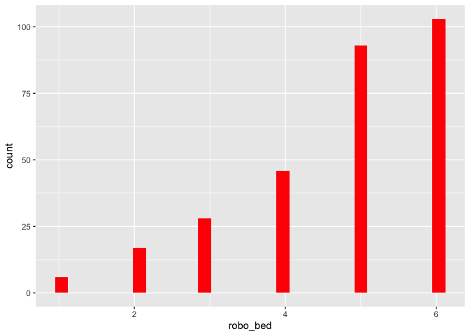
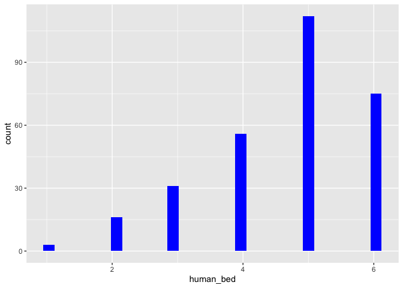

Dies sind die desktiptiven Statistiken für den Datensatz.
=========================================================

Man sieht deskriptiv, dass die Probanden sich eher von einem Roboter,
als von einem Menschen ins Bett legen lassen würden.

    dataset.short %>% psych::describe() %>% select(vars, mean, sd, median, min, max) 

    ##           vars  mean    sd median min max
    ## age          1 32.25 13.83   26.0  19  81
    ## gender*      2  2.58  0.51    3.0   1   3
    ## kut          3  4.32  1.03    4.5   1   6
    ## robo_bed     4  4.75  1.30    5.0   1   6
    ## human_bed    5  4.65  1.19    5.0   1   6

Histogramme.
============

    dataset %>% ggplot() +  aes(x = robo_bed) + geom_histogram(bins = 30, fill="red")

    dataset %>% ggplot() +  aes(x = human_bed) + geom_histogram(bins = 30, fill="blue")

