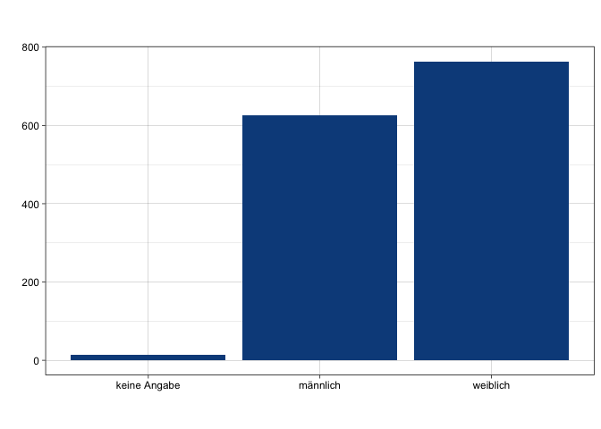
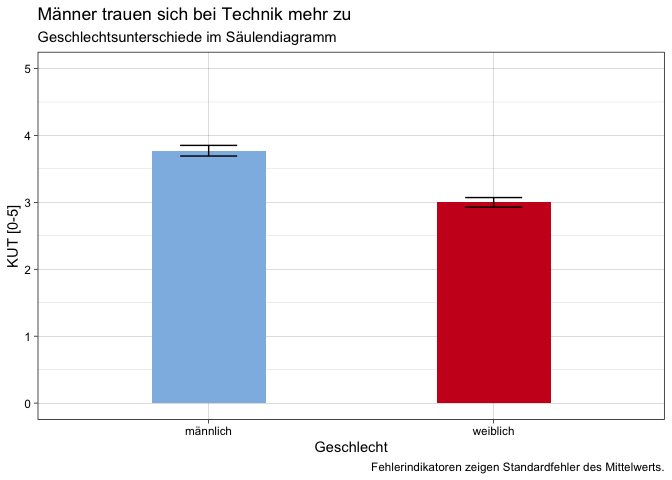
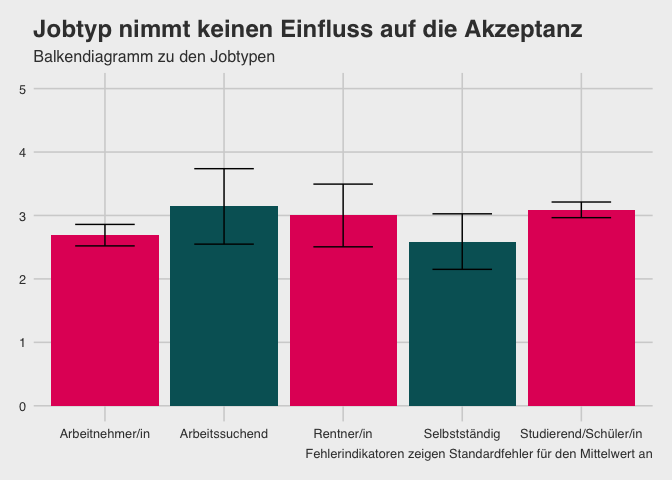

    ggplot(datensatz) +
     aes(x = gender, weight = kut) +
     geom_bar(fill = "#0c4c8a") +
     labs(x = " ", 
          y = " ", 
          title = " ", 
          subtitle = " ", 
          caption = " ") +
     theme_linedraw()

Nach Anpassungen:
=================

    datensatz %>% 
      filter(gender != "keine Angabe") %>% 
      group_by(gender) %>% 
      summarise(kut_m = mean(kut)-1, kut_sem = std.error(kut)) %>% 
    ggplot() +
      aes(x = gender, weight = kut_m, ymin = kut_m-kut_sem , ymax = kut_m+kut_sem, fill = gender) +
      geom_bar(fill = c(rwthfarben$lightblue, rwthfarben$red), width = 0.4) +
      geom_errorbar(width = 0.2) +
      scale_y_continuous(limits = c(0,5)) +
      #labs(x = "Geschlecht", 
      #     y = "KUT [0-5]", 
      #     title = "Männer trauen sich bei Technik mehr zu", 
      #     subtitle = "Geschlechtsunterschiede im Säulendiagramm", 
      #     caption = "Fehlerindikatoren zeigen Standardfehler des Mittelwerts.") +
      theme_minimal() +
      NULL

    ggsave("Diagramm_HildebrandtCalero2.pdf")

    ## Saving 7 x 5 in image

    devtools::install_github("HCIC/r-tools")

    ## Skipping install of 'hcictools' from a github remote, the SHA1 (7d8e5458) has not changed since last install.
    ##   Use `force = TRUE` to force installation

    rwthfarben <- hcictools::rwth.colorpalette()
    # Balkendiagramm (Jobtyp und robo_toilett)
    datensatz %>%
    filter(job_type != "keine Angabe") %>%
    group_by(job_type) %>%
    summarise(robo_toilett_m = mean(robo_toilett, na.rm = TRUE)-1, robo_toilett_sem = std.error(robo_toilett)) %>%
      ggplot() +
      aes(x = job_type, weight = robo_toilett_m, ymin = robo_toilett_m-robo_toilett_sem , ymax = robo_toilett_m+robo_toilett_sem, fill = job_type) +
      geom_bar(fill = c(rwthfarben$magenta, rwthfarben$petrol, rwthfarben$magenta, rwthfarben$petrol, rwthfarben$magenta)) +
      geom_errorbar(width = 0.5) +
      scale_y_continuous(limits = c(0,5)) +
      labs(x = "Jobtyp",
          y = "Anzahl der Zustimmungen",
          title = "Jobtyp nimmt keinen Einfluss auf die Akzeptanz",
          subtitle = "Balkendiagramm zu den Jobtypen",
          caption = "Fehlerindikatoren zeigen Standardfehler für den Mittelwert an") +
     theme_fivethirtyeight()

    NULL

    ## NULL

    ggsave("Diagramm_GaneshabalanStuhlmannKlein.pdf", width = 210, height = 297, units = "mm")
