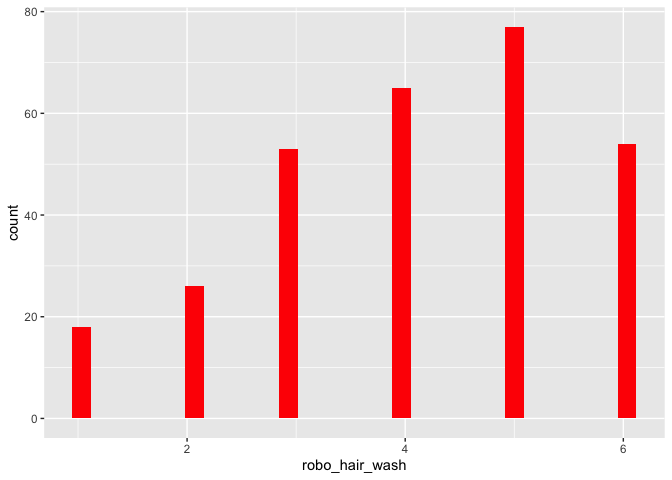
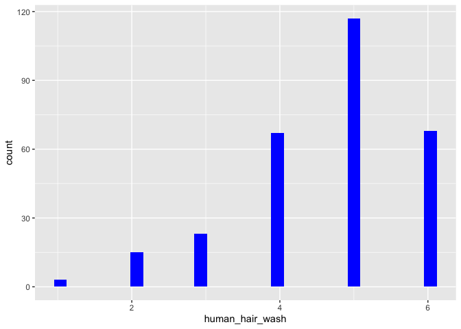

Man sieht deskriptiv, dass die Probanden sich eher von einem Menschen,
als von einem Roboter die Haare waschen lassen würden.

    ##                 vars   n  mean    sd median trimmed  mad min max range  skew
    ## age                1 325 32.25 13.83     26   30.13 5.93  19  81    62  1.25
    ## human_hair_wash    2 293  4.65  1.13      5    4.78 1.48   1   6     5 -0.88
    ## robo_hair_wash     3 293  4.09  1.44      4    4.19 1.48   1   6     5 -0.45
    ##                 kurtosis   se
    ## age                 0.36 0.77
    ## human_hair_wash     0.50 0.07
    ## robo_hair_wash     -0.67 0.08

