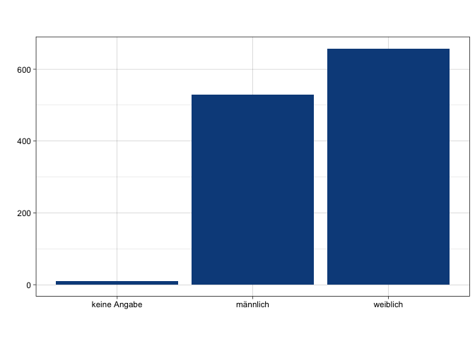
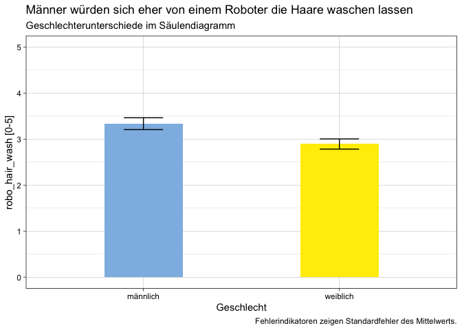

    ggplot(datensatz) +
     aes(x = gender, weight = robo_hair_wash) +
     geom_bar(fill = "#0c4c8a") +
     labs(x = " ", 
          y = " ", 
          title = " ", 
          subtitle = " ", 
          caption = " ") +
     theme_linedraw()

    datensatz %>% 
      filter(gender != "keine Angabe") %>% 
      group_by(gender) %>% 
      summarise(robo_hair_wash_m = mean(robo_hair_wash, na.rm = TRUE)-1, robo_hair_wash_sem = std.error(robo_hair_wash)) %>% 
    ggplot() +
     aes(x = gender, weight = robo_hair_wash_m, ymin = robo_hair_wash_m-robo_hair_wash_sem, ymax = robo_hair_wash_m+robo_hair_wash_sem, fill = gender) +
     geom_bar(fill = c(rwthfarben$lightblue, rwthfarben$yellow), width = 0.4) + 
     geom_errorbar(width = 0.2) + 
     scale_y_continuous(limits = c(0,5)) +
     labs(x = "Geschlecht", 
          y = "robo_hair_wash [0-5]", 
          title = "Männer würden sich eher von einem Roboter die Haare waschen lassen", 
          subtitle = "Geschlechterunterschiede im Säulendiagramm", 
          caption = "Fehlerindikatoren zeigen Standardfehler des Mittelwerts.") +
     theme_linedraw() +
     NULL

