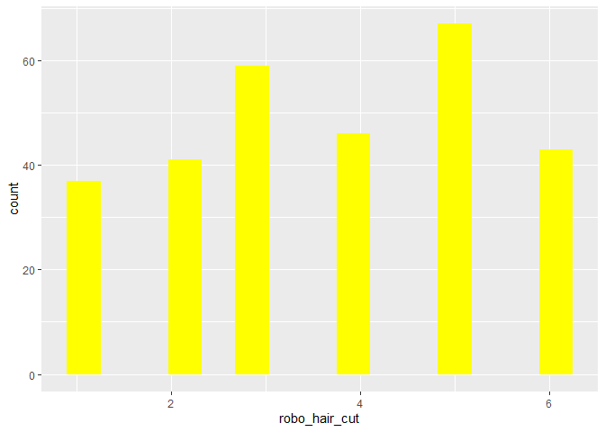
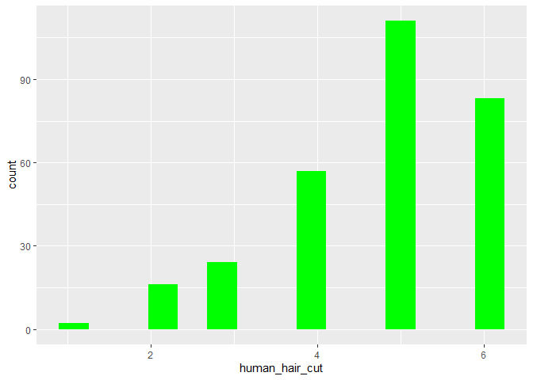

    # Mit Pipe 
    data %>% select(age, gender, robo_hair_cut, human_hair_cut) %>% psych::describe() %>% select( vars, mean, sd, median, min, max)

    ##                vars  mean    sd median min max
    ## age               1 32.25 13.83     26  19  81
    ## gender*           2  2.58  0.51      3   1   3
    ## robo_hair_cut     3  3.66  1.61      4   1   6
    ## human_hair_cut    4  4.73  1.16      5   1   6

    # Ohne Pipe 
    psych::describe(select(data, age, gender, robo_hair_cut, human_hair_cut))

    ##                vars   n  mean    sd median trimmed  mad min max range
    ## age               1 325 32.25 13.83     26   30.13 5.93  19  81    62
    ## gender*           2 325  2.58  0.51      3    2.61 0.00   1   3     2
    ## robo_hair_cut     3 293  3.66  1.61      4    3.70 1.48   1   6     5
    ## human_hair_cut    4 293  4.73  1.16      5    4.88 1.48   1   6     5
    ##                 skew kurtosis   se
    ## age             1.25     0.36 0.77
    ## gender*        -0.52    -1.25 0.03
    ## robo_hair_cut  -0.16    -1.15 0.09
    ## human_hair_cut -0.90     0.29 0.07

    data %>% select(robo_hair_cut) %>% ggplot() + aes(x = robo_hair_cut) + geom_histogram(bins = 15, fill="yellow")

    ## Warning: Removed 32 rows containing non-finite values (stat_bin).

    data %>% select(human_hair_cut) %>% ggplot() + aes(x = human_hair_cut) + geom_histogram(bins = 15, fill="green")

    ## Warning: Removed 32 rows containing non-finite values (stat_bin).

Die Diagramme zeigen, dass sich die Probanden eher von einem Menschen
als von einem Roboter die Haare schneiden lassen würden.
