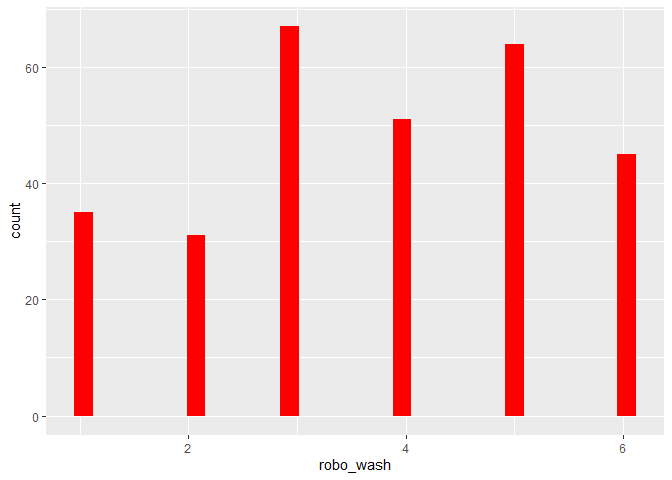
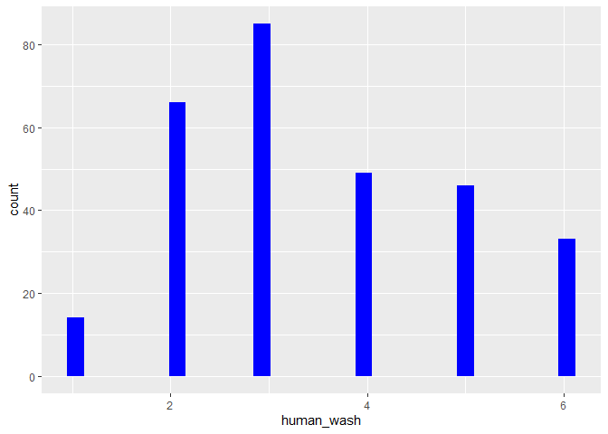

Dies sind die desktiptiven Statistiken für den Datensatz.
=========================================================

Man sieht deskriptiv, dass die Probanden sich eher von einem Roboter,
als von einem Menschen waschen lassen würden.

    ##Pipe
    dataset_short <- dataset %>% select(robo_wash, human_wash)
    dataset.short %>% psych::describe() %>% select(vars, mean, sd, median, min, max) 

    ##            vars  mean    sd median min max
    ## age           1 32.25 13.83   26.0  19  81
    ## gender*       2  2.58  0.51    3.0   1   3
    ## kut           3  4.32  1.03    4.5   1   6
    ## robo_wash     4  3.73  1.58    4.0   1   6
    ## human_wash    5  3.50  1.41    3.0   1   6

    ##ohne Pipe
    #psych::describe(select(dataset, age, gender, robo_wash, human_wash))

Histogramme.
============

    dataset %>% ggplot() +  aes(x = robo_wash) + geom_histogram(bins = 30, fill="red")

    dataset %>% ggplot() +  aes(x = human_wash) + geom_histogram(bins = 30, fill="blue")

