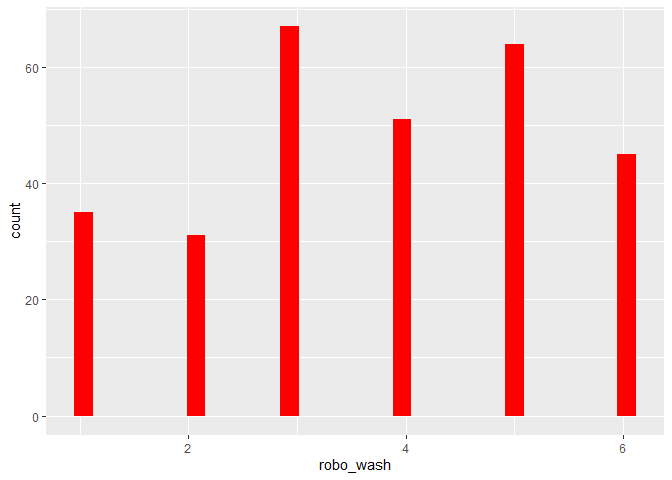
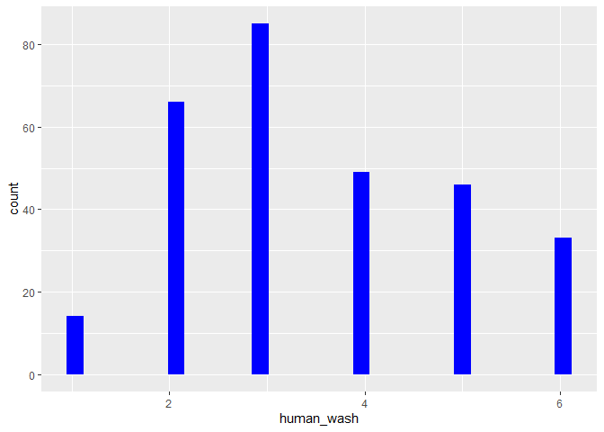

Deskriptive Statistik
================
Lukas Steinke
29 11 2019

Man sieht deskriptiv, dass die Probanden sich eher von einem Roboter,
als von einem Menschen waschen lassen würden.

``` r
##Pipe
datensatz_kurz <- datensatz %>% select(age, gender, robo_wash, human_wash)
datensatz_kurz %>% psych::describe() %>% select (vars, mean, sd, median, min, max)
```

    ##            vars  mean    sd median min max
    ## age           1 32.25 13.83     26  19  81
    ## gender*       2  2.58  0.51      3   1   3
    ## robo_wash     3  3.73  1.58      4   1   6
    ## human_wash    4  3.50  1.41      3   1   6

``` r
##ohne Pipe
#psych::describe(select(datensatz, age, gender, robo_wash, human_wash))
```

## Histogramme

``` r
datensatz %>% ggplot() +  aes(x = robo_wash) + geom_histogram(bins = 30, fill="red")
```

<!-- -->

``` r
datensatz %>% ggplot() +  aes(x = human_wash) + geom_histogram(bins = 30, fill="blue")
```

<!-- -->
