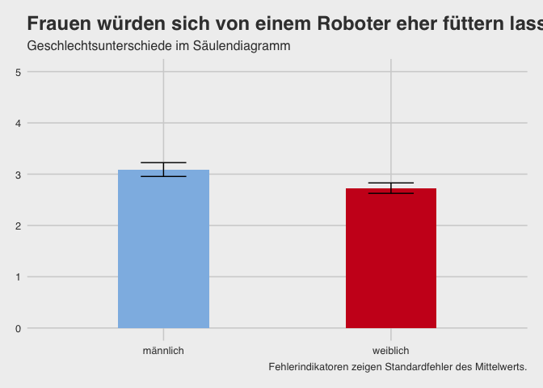

    dataset %>% 
      filter(gender != "keine Angabe") %>%
      group_by(gender) %>%
      summarise(Mean = mean(robo_food, na.rm = TRUE)-1, sem = std.error(robo_food)) %>% 
      ggplot() +
      aes(x = gender, weight = Mean, ymin = Mean-sem , ymax = Mean+sem, fill = gender) +
      geom_bar(fill = c(rwthfarben$lightblue, rwthfarben$red), width = 0.4) +
      geom_errorbar(width = 0.2) +
      scale_y_continuous(limits = c(0,5)) +
      labs(x = "Geschlecht",
          y = "Bereitschaft, sich von einem Roboter füttern zu lassen",
          title = "Frauen würden sich von einem Roboter eher füttern lassen.",
          subtitle = "Geschlechtsunterschiede im Säulendiagramm",
          caption = "Fehlerindikatoren zeigen Standardfehler des Mittelwerts.") +
     theme_fivethirtyeight() +
      NULL

