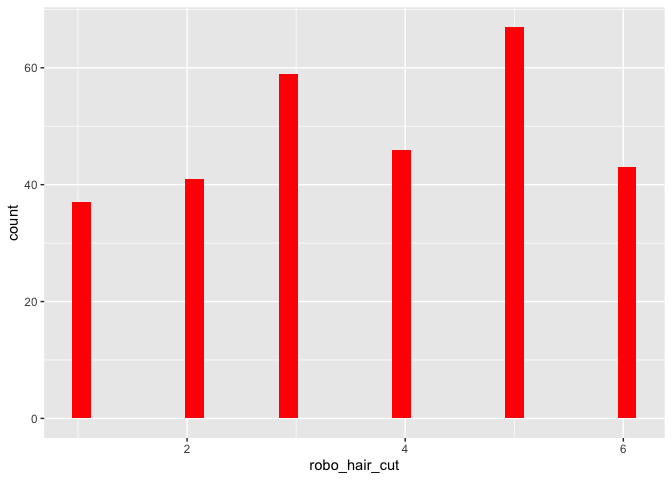
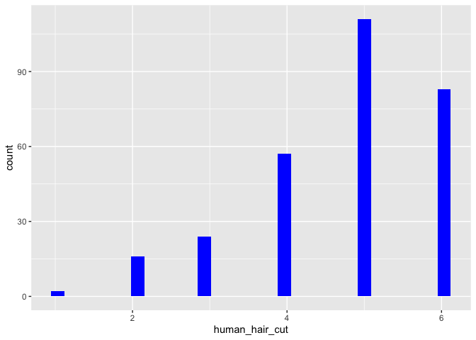

Dies sind die desktiptiven Statistiken für den Datensatz.
=========================================================

Man sieht deskriptiv, dass sich die Probanden eher von einem Menschen,
als von einem Roboter die Haare schneiden lassen würden.

### mit Pipe

    dataset.short %>% psych::describe() %>% select(vars, mean, sd, median, min, max) 

    ##                vars  mean    sd median min max
    ## age               1 32.25 13.83   26.0  19  81
    ## gender*           2  2.58  0.51    3.0   1   3
    ## kut               3  4.32  1.03    4.5   1   6
    ## robo_hair_cut     4  3.66  1.61    4.0   1   6
    ## human_hair_cut    5  4.73  1.16    5.0   1   6

### ohne Pipe

    #### select(psych::describe(dataset.short), vars, mean, sd, median, min, max)

Histogramme.
============

    dataset %>% ggplot() +  aes(x = robo_hair_cut) + geom_histogram(bins = 30, fill="red")

    dataset %>% ggplot() +  aes(x = human_hair_cut) + geom_histogram(bins = 30, fill="blue")

