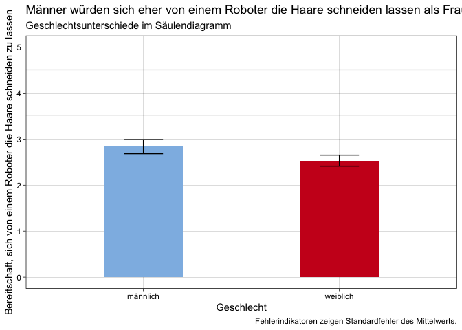
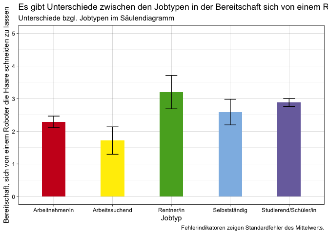

### Diagramm 1 (Geschlecht)

    dataset %>% 
      filter(gender != "keine Angabe") %>%
      group_by(gender) %>%
      summarise(robo_m = mean(robo_hair_cut, na.rm = TRUE)-1, robo_sem = std.error(robo_hair_cut)) %>% 
      ggplot() +
      aes(x = gender, weight = robo_m, ymin = robo_m - robo_sem , ymax = robo_m + robo_sem, fill = gender) +
      geom_bar(fill = c(rwthfarben$lightblue, rwthfarben$red), width = 0.4) +
      geom_errorbar(width = 0.2) +
      scale_y_continuous(limits = c(0,5)) +
      labs(x = "Geschlecht",
          y = "Bereitschaft, sich von einem Robert die Haare schneiden zu lassen",
          title = "Frauen würden sich eher von einem Roboter die Haare schneiden lassen als Männer.",
          subtitle = "Geschlechtsunterschiede im Säulendiagramm",
          caption = "Fehlerindikatoren zeigen Standardfehler des Mittelwerts.") +
     theme_linedraw() +
      NULL

    ggsave("Diagramm_Geschlecht.pdf", width = 9, height = 10)

### Diagramm 2 (Jobtyp)

    dataset %>% 
      filter(job_type != "keine Angabe") %>%
      group_by(job_type) %>%
      summarise(robo2_m = mean(robo_hair_cut, na.rm = TRUE)-1, robo2_sem = std.error(robo_hair_cut)) %>% 
      ggplot() +
      aes(x = job_type, weight = robo2_m, ymin = robo2_m - robo2_sem , ymax = robo2_m + robo2_sem, fill = job_type) +
      geom_bar(fill = c(rwthfarben$red, rwthfarben$yellow, rwthfarben$green, rwthfarben$lightblue, rwthfarben$purple), width = 0.4) +
      geom_errorbar(width = 0.2) +
      scale_y_continuous(limits = c(0,5)) +
      labs(x = "Jobtyp",
          y = "Bereitschaft, sich von einem Robert die Haare schneiden zu lassen",
          title = "Es gibt Unterschiede zwischen den Jobtypen in der Bereitschaft sich von einem Roboter die Haare schneiden zu lassen.",
          subtitle = "Unterschiede bzgl. Jobtypen im Säulendiagramm",
          caption = "Fehlerindikatoren zeigen Standardfehler des Mittelwerts.") +
     theme_linedraw() +
      NULL

    ggsave("Diagramm_Jobtyp.pdf", width = 15, height = 10)
