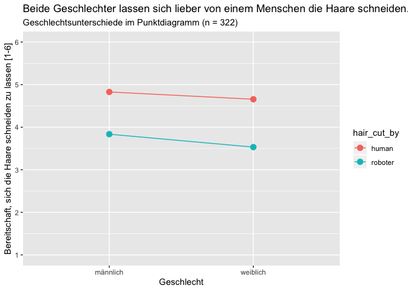

    dataset %>%
      filter(gender != "keine Angabe") %>%
      group_by(gender) %>%
      summarise(human = mean(human_hair_cut, na.rm = TRUE),
                roboter = mean(robo_hair_cut, na.rm = TRUE)) %>%
      pivot_longer(cols = c(human, roboter),
                   names_to = "hair_cut_by",
                   values_to = "value") %>%
      ggplot() +
      aes(x = gender, y = value, color = hair_cut_by, group = hair_cut_by) +
      geom_point(size = 3) +
      geom_line() +
      scale_y_continuous(limits = c(1,6), breaks = 1:6) +
      labs(title = "Beide Geschlechter lassen sich lieber von einem Menschen die Haare schneiden.",
           subtitle = "Geschlechtsunterschiede im Punktdiagramm (n = 322)",
           x = "Geschlecht",
           y = "Bereitschaft, sich die Haare schneiden zu lassen [1-6]")

